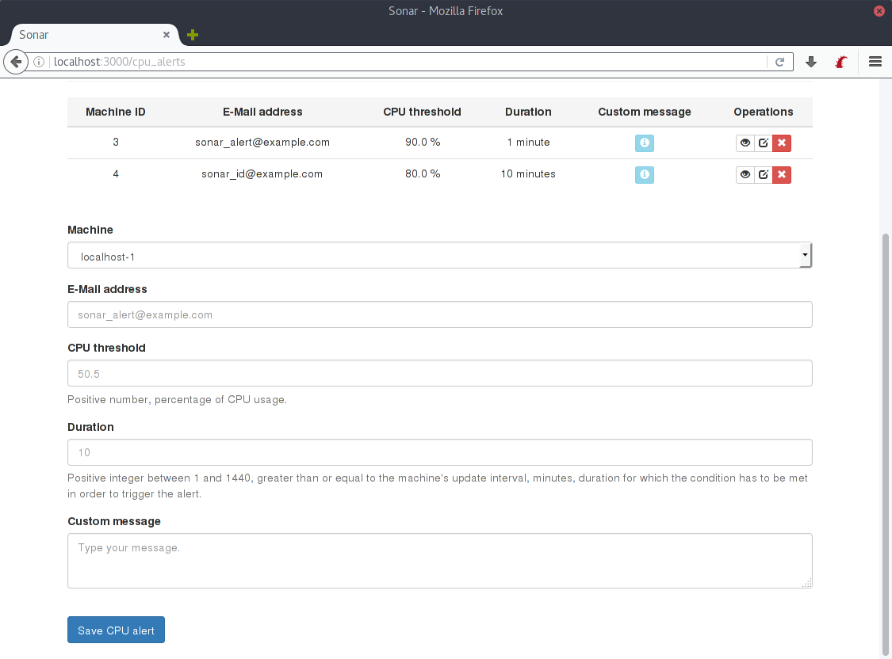
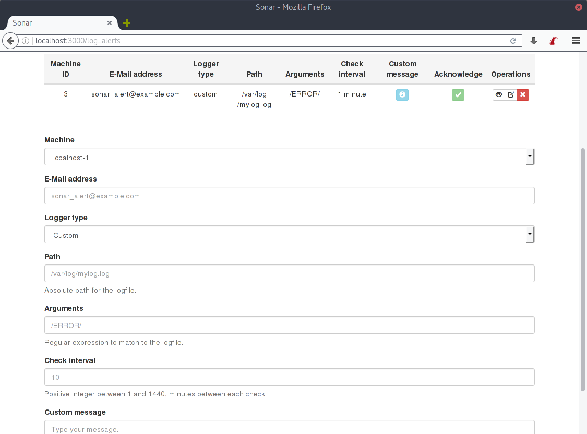
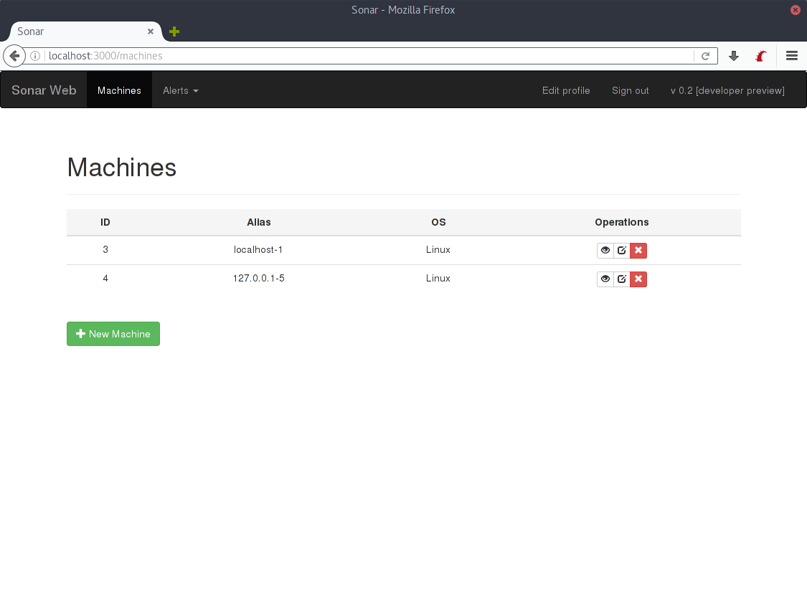
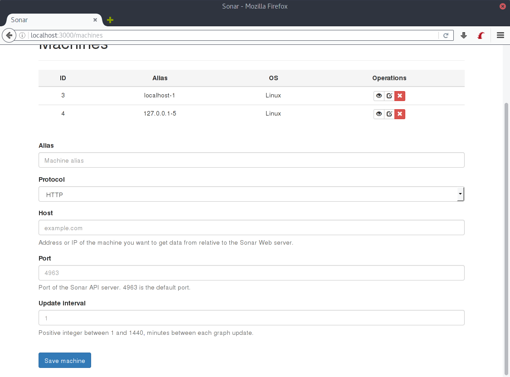

Introduction
============

(Note: This documentation was written during development stage, so some screenshots, or techniques described might be slightly different in the final release).

Sonar is an easy to use and simple monitoring tool, and it is written in Ruby on Rails.

Sonar is designed to feature a client-server model, so that the server part is a web interface, with graphics and alerts, installed on a standalone server, while the client part is installed on each machine you want to monitor. The server uses "polling", which means that it checks periodically each client. The minimum amount for polling is 1 (one) minute or 60 (sixty) seconds. But can go as high as 1 (one) day.

The clients expose the 4963/TCP port and use the HTTP protocol. HTTPS can be configured but at the time of writing it's completely unsupported. Sonar Web uses the 3000 port by default, like any other standard Rails app.

Sonar Web must be able to reach the clients. So, for example, if the clients are behind a NAT, or a firewall, ports must be opened, but that's beyond the scope of this documentation. You can consult your ISP, router, or firewall documentation for more info on how to open ports.

## Alerts

Sonar is designed to be light on resources, while also having the ability to activate automatic alerts in four different situations:

### CPU and RAM alerts

Triggered when the CPU or the RAM (system memory) exceeds a specified percentage of usage. Additionally, it can be configured to have a "duration" set so that the alert is only triggered when the CPU exceeds the specified percentage for a certain duration.

### Storage alerts

Triggered when a storage mountpoint (a hard disk drive, or a solid disk drive) exceeds a specified amount.

### Log alerts

Triggered when a logfile matches a certain regular expression.

### Alert behaviour

In the first three cases, an alert through e-mail will be sent when the conditions for activating the alert are met. Additionally, a second mail will be sent when this condition is no longer met, informing users that the alert is over.

In the fourth case (log alerts), the alert can only be solved manually, so, once the condition is met and the alert is fired, you can go into the log alerts to deactivate a specific alert. What this does is record in the database the amount of matches for the given logfile, and then deactivates the alert (as if it was solved).

## Machines

Sonar can manage a pool of machines from different IPs.

To add a machine to monitor, you need to know the protocol to use (HTTP by default), the hostname or IP, and the port to use (4963 by default). It's important the machine is online when adding it because otherwise Sonar will fail adding the machine due to the way Sonar works which checks connection when adding a new machine.

Once a machine has been added, Sonar can show you details about it, like the OS it runs, the CPU usage, the RAM usage as well as the general storage usage.