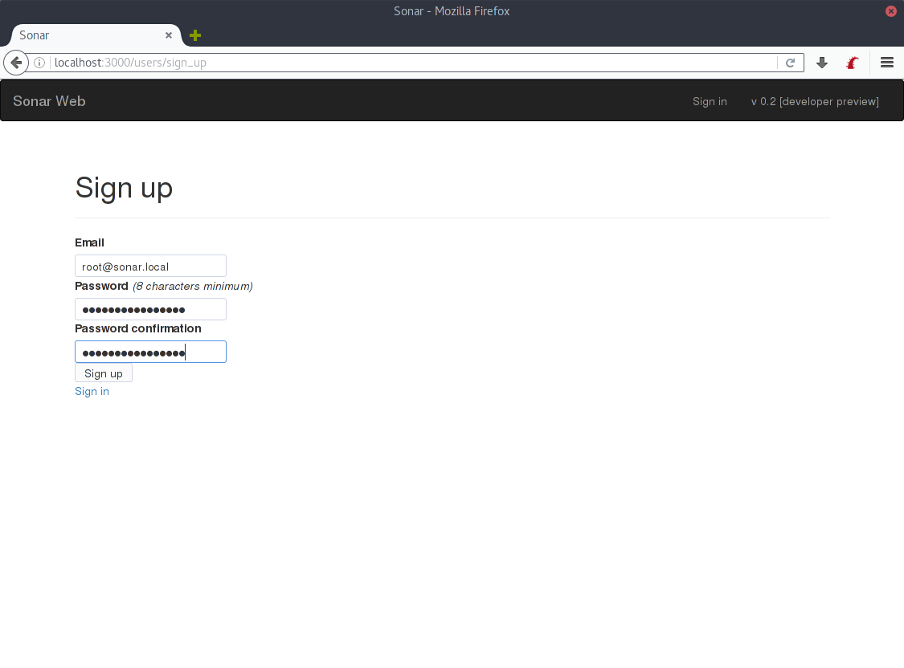
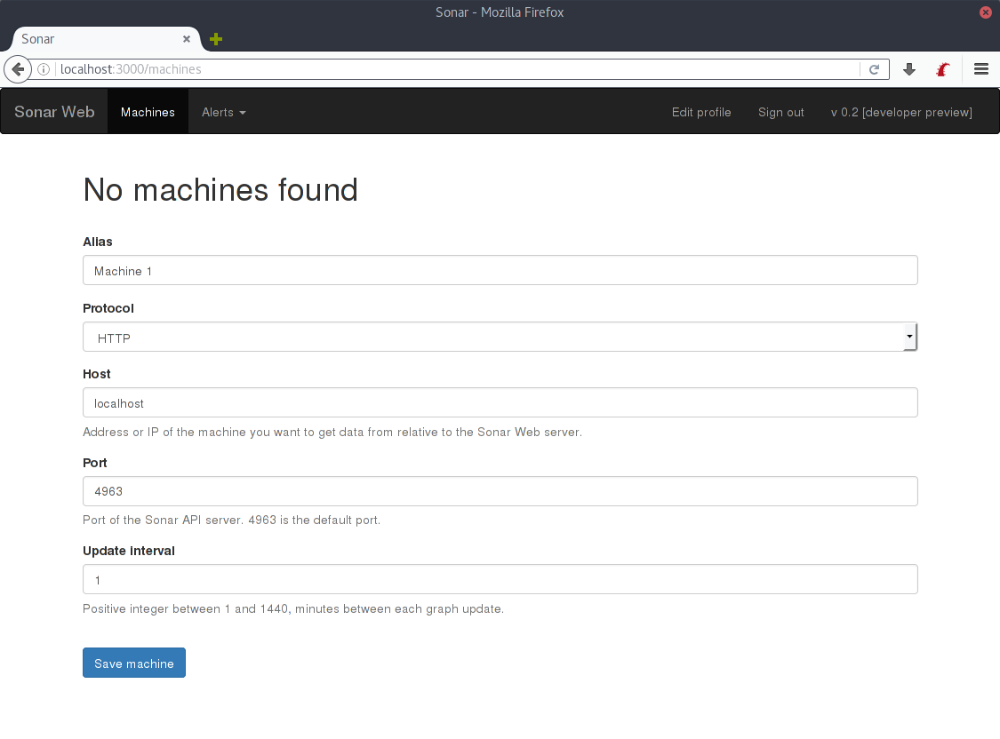
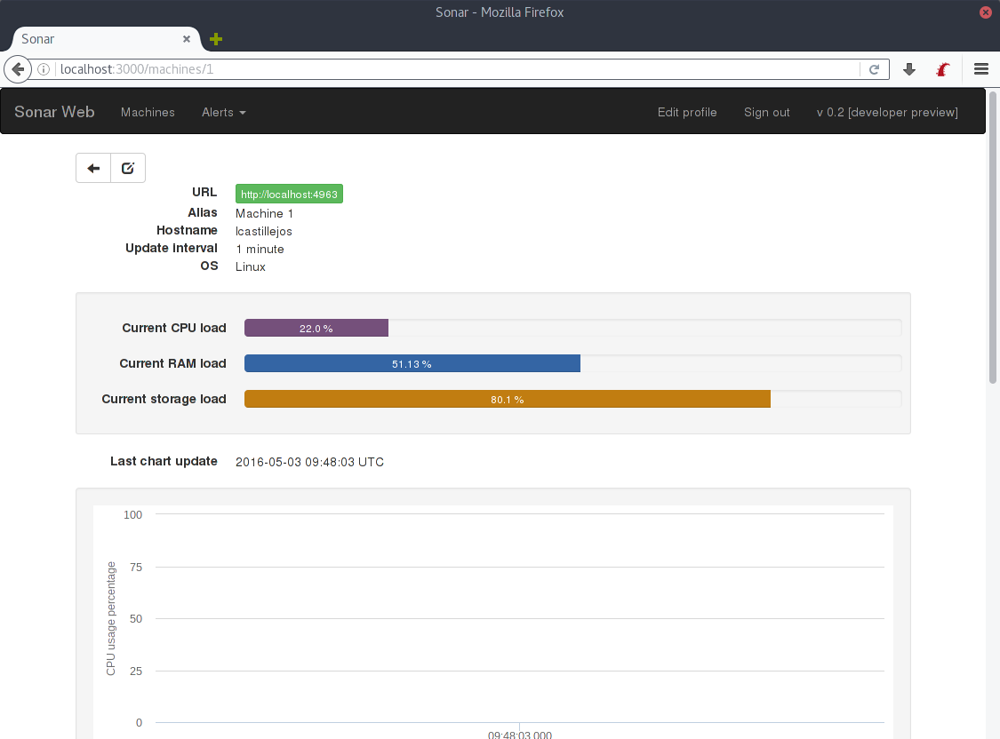

3 - Configuring Sonar
=====================

Once Sonar Web and Sonar API has been configured in the hosts you want (they can even be in the same host simultaneously) you can add your first machine through the Sonar interface like this:

First, you need to go to the `sonar/src/sonar/sonar_server/config/routes.rb` file and comment the line that says:

```ruby
  get 'users/sign_up' => redirect('/403.html')
```

So it looks like:

```ruby
  # get 'users/sign_up' => redirect('/403.html')
```

This will allow you to sign up, creating credentials for a user.

Then, go to `YOUR.IP.ADDRESS.OR.HOSTNAME:3000/sign_up` if you have configured the port or are using a server like Nginx, then use that port. If you're running it on the same machine you can use `localhost:3000/sign_up`. For the purpose of this guide, I will be creating the `root@sonar.local` username with the same password.



Once you have created your user, you can now uncomment again the line at `sonar/src/sonar/sonar_server/config/routes.rb`, so nobody can create new users.

Then, using the navigation bar (black stripe at the top), you can now browse to the "Machines" tab. Since it has just been installed, there will be no machines. I will be adding one. In my case, the hostname is localhost because the machine I want to monitor is the same where Sonar Web is installed (Sonar Web and Sonar API on the same host), which will usually not be the case. So replace `localhost` with whatever you need.



Once the machine has been added, you will see it in the list. You can press the eye button to see more details about it:



At first the graphs will be empty, but they will be filling at the specified rate. In my case, every minute.

Once this is done, you can add alerts.