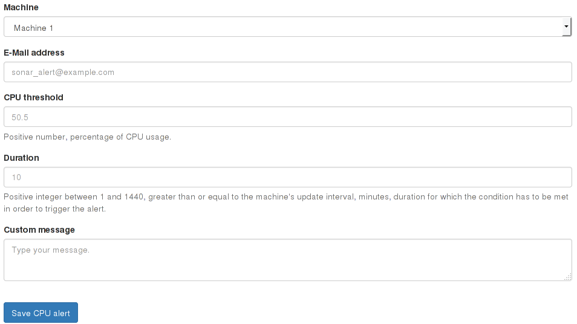

4 - CPU and RAM alerts
======================

Since CPU and RAM alerts work in a similar way, these steps are common for both alerts.

## Adding a new alert

To create a new alert, you need to specify a few parameters:
- Machine providing the metrics (Sonar API)
- E-Mail address to send the alert to
- CPU/RAM threshold
- Duration

The duration is a field where you can specify how long the condition has to be met in order to trigger the alert. It has to be at least equal to the machine check interval. This means that if a RAM alert is set to trigger at 90% with a duration of 60 minutes and a refresh rate, it will not trigger until the machine has been consistently over 90% of RAM for 1 hour. If the machine, at any point goes below 90%, the alert will not be triggered until 60 cycles (that is, 60 checks for 1 minutes, or 60/1) have been checked to be above 90%. If instead the machine is set to be checked every 10 minutes and the alert for a duration of 60 minutes, then the alert will be checked to have the threshold met in 6 consecutive cycles (or 60/10).

The custom message field is optional and will be displayed when the alert is triggered. This message can contain anything the system administrator might want to tell the users. It can only contain plain text and newlines.

And that's it! You can now create your alert and it will be checked at the same rate Sonar checks the machine's metrics.