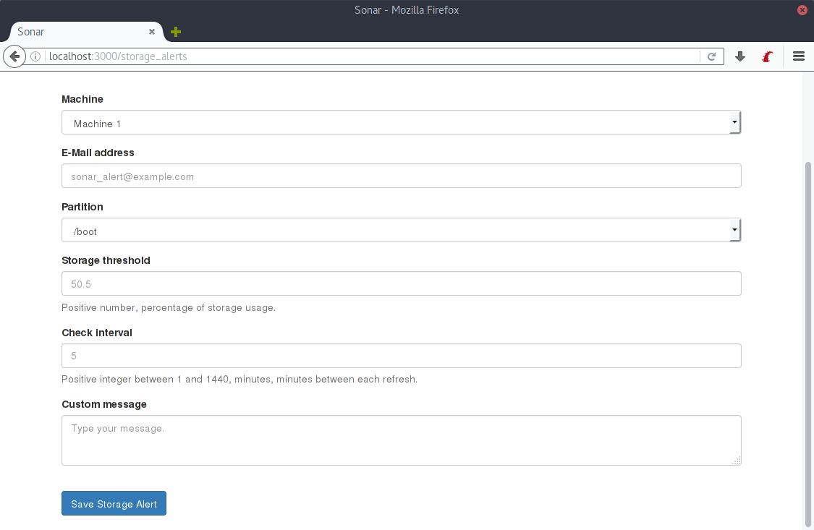

5 - Storage Alerts
==================

Storage alerts allow you to check the storage used in a specific mountpoint.

## Adding a new storage alert

To create a new storage alert, you need to specify a few parameters:
- Machine providing the metrics (Sonar API)
- E-Mail address to send the alert to
- Partition/mountpoint
- Storage threshold
- Check interval

The check interval specifies how often should Sonar retrieve the storage information through the API.

The custom message field is optional and will be displayed when the alert is triggered. This message can contain anything the system administrator might want to tell the users. It can only contain plain text and newlines.

And that's it! You can now create your alert and it will be checked at the same rate Sonar checks the machine's metrics.