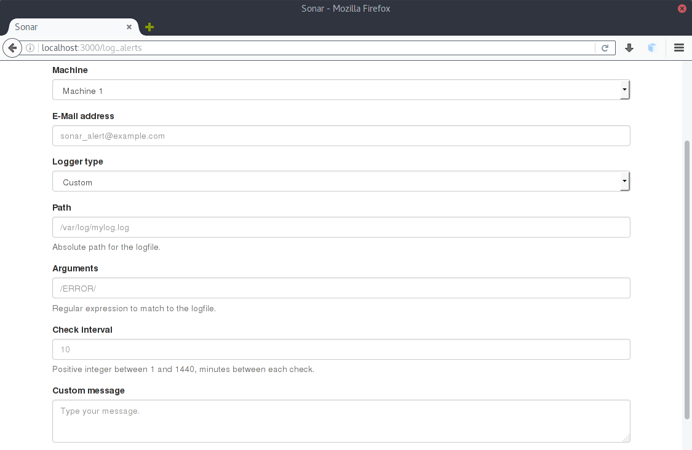

6 - Log Alerts
==================

Log alerts allow you to check specific files for patterns. It is useful to check when a string (like `ERROR` appears in a file).

## Adding a new storage alert

To create a new storage alert, you need to specify a few parameters:
- Machine providing the metrics (Sonar API)
- E-Mail address to send the alert to
- Logger type (this is not yet functional, but will be in future releases)
- Path (of the logfile to monitor)
- Arguments (regular expression to match)
- Check interval

The logger type for now can only be set to "custom". The path indicates where the logfile is stored. The arguments field constitues a regular expression. At the most basic level, a regular expression to match appearances of `messages` is written as `/message/`. The slashes are necessary to form a valid RegExp and will not work without it.

The check interval specifies how often should Sonar try to match the specified regular expression against the given file.

The custom message field is optional and will be displayed when the alert is triggered. This message can contain anything the system administrator might want to tell the users. It can only contain plain text and newlines.